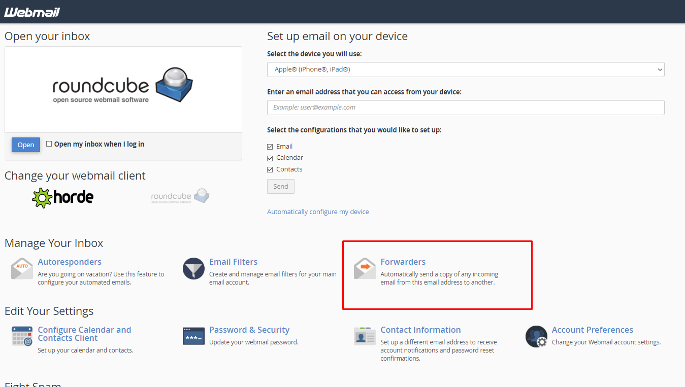
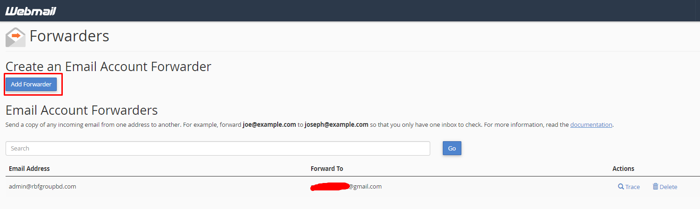

# ContactUsForm-with-Cpanel
This Contact Us Form will help you to get in touch with your website client immediately after they send you a feedback or message. 
This message will be forwaded to your any gmail, hotmail, outlook or any others email addresses. 

First follow the coding process then configure your webmail page from Cpanel. 

**Step 1:**
Login in your Cpanel and Go to Emai Account and Click on **CHECK MAIL**

**Step 2:**
After clicking check **CHECK MAIL** you will find **Forwarders** in the right side slightly botton of the page.

**Step 3:**
The final part is to set a valid mail address where you want to forward your website feedback or message.

Hope this will help you as an alternative of using PHPmailer.

**HappyCoding**

